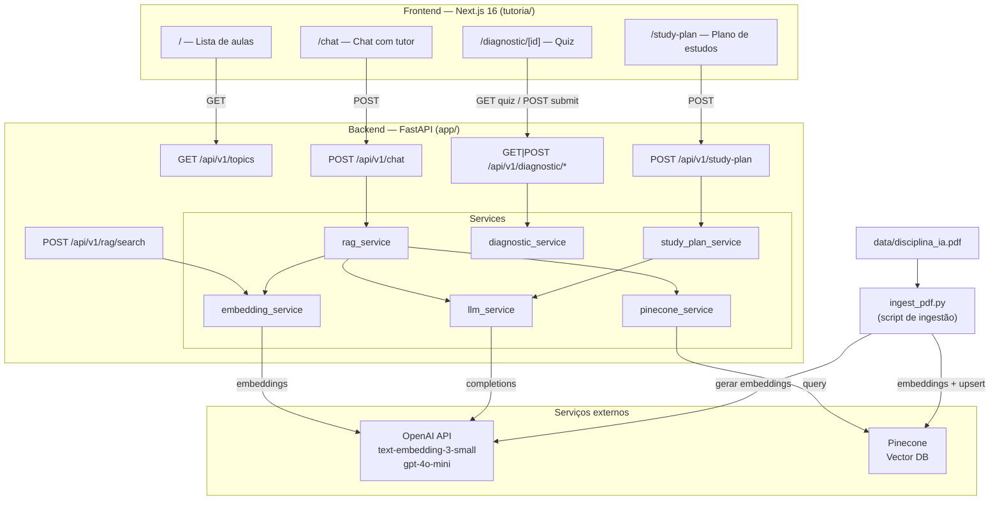
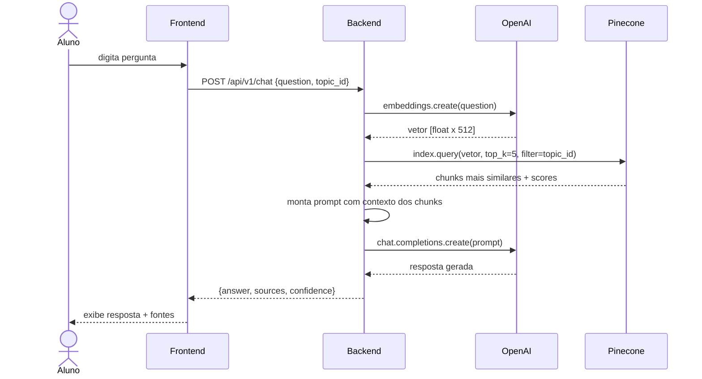
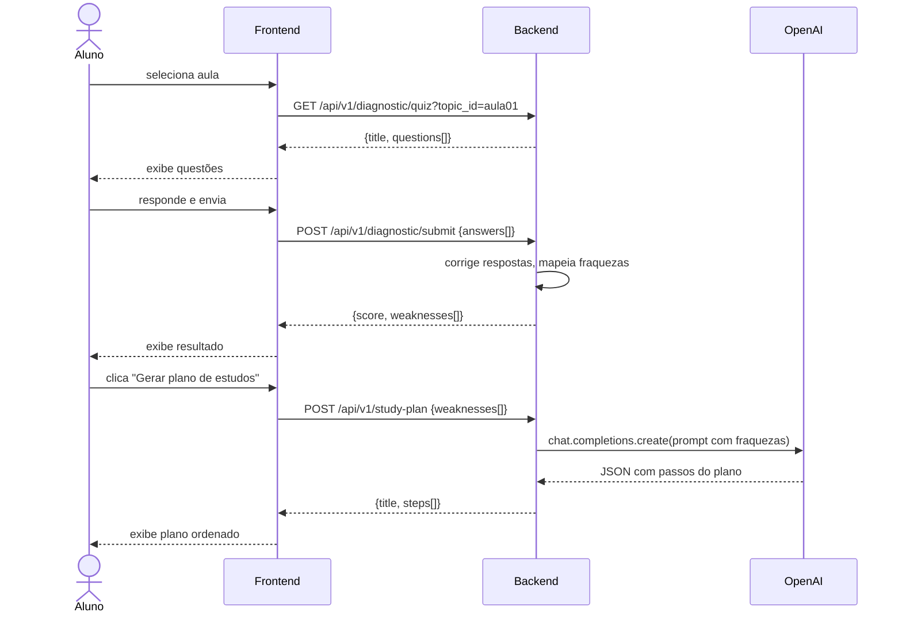

# TutorIA — CC0121 Inteligência Artificial

Tutor inteligente para a disciplina **CC0121 — Inteligência Artificial** da UNIFAP.
Combina RAG (Retrieval-Augmented Generation) com um frontend Next.js para oferecer chat com tutor, quiz diagnóstico por aula e plano de estudos personalizado.

**Equipe:** Evelyn Santos · Johnathan Rocha · Aymmée Diniz

---

## Arquitetura

### Visão geral dos componentes



### Fluxo do chat (RAG)



### Fluxo do diagnóstico → plano de estudos



---

## Funcionalidades

### Home — lista de aulas
- 7 aulas da disciplina exibidas em cards.
- Cada card tem atalho direto para o quiz diagnóstico e para o chat filtrado pela aula.

### Quiz diagnóstico (`/diagnostic/[id]`)
- 3 a 4 questões de múltipla escolha por aula.
- Após submissão: score, porcentagem de acerto e lista de tópicos com dificuldade.
- Botão para gerar plano de estudos com base nas fraquezas identificadas.

### Chat com o tutor (`/chat`)
- Pergunta livre em linguagem natural.
- Filtro opcional por aula (restringe busca vetorial ao namespace da aula).
- Resposta com fontes (página do PDF, score de similaridade e confiança média).
- Histórico de conversa mantido no cliente durante a sessão.

### Plano de estudos (`/study-plan`)
- Gerado dinamicamente pelo LLM com base nas fraquezas do quiz.
- Passos ordenados do conteúdo mais fundamental ao mais avançado.
- Cada passo inclui tópico, descrição e referência à aula correspondente.

---

## Pré-requisitos

| Ferramenta | Versão mínima |
|---|---|
| Python | 3.12 |
| Node.js | 20 |
| npm | 10 |
| Conta OpenAI | — |
| Conta Pinecone | — |

---

## Instalação

### 1. Clonar o repositório

```bash
git clone <url-do-repo>
cd projeto-ia-unifap
```

### 2. Configurar variáveis de ambiente

Copie o arquivo de exemplo e preencha com suas chaves:

```bash
cp .env.example .env
```

Edite `.env`:

```env
PINECONE_API_KEY=sua_chave_pinecone
PINECONE_HOST=https://seu-index.svc.aped-xxxx-xxxx.pinecone.io
PINECONE_NAMESPACE=disciplina-ia

OPENAI_API_KEY=sua_chave_openai

# Valores padrão — altere se necessário
EMBEDDING_MODEL=text-embedding-3-small
EMBEDDING_DIMENSION=512
LLM_MODEL=gpt-4o-mini
LLM_TEMPERATURE=0.2
```

### 3. Backend (FastAPI)

```bash
# Criar e ativar ambiente virtual
python -m venv .venv
source .venv/bin/activate        # Linux/macOS
# .venv\Scripts\activate         # Windows

# Instalar dependências
pip install -r requirements.txt

# Iniciar servidor (porta 8000)
python run.py
```

API disponível em `http://localhost:8000`.
Documentação interativa em `http://localhost:8000/docs`.

### 4. Ingestão do PDF (primeira vez)

> Necessário apenas uma vez para popular o índice Pinecone.

Coloque o PDF do material da disciplina em `data/disciplina_ia.pdf` e execute:

```bash
python ingest_pdf.py
```

O script extrai texto página a página, gera chunks de ~800 palavras com sobreposição de 100, cria embeddings via OpenAI e envia em lotes para o Pinecone.

### 5. Frontend (Next.js)

```bash
cd tutoria

# Instalar dependências
npm install

# Iniciar servidor de desenvolvimento (porta 3000)
npm run dev
```

App disponível em `http://localhost:3000`.

> O frontend lê a URL do backend via `NEXT_PUBLIC_API_URL`. O arquivo `tutoria/.env.local` já vem configurado para `http://localhost:8000/api/v1`.

---

## Scripts úteis

| Comando | Descrição |
|---|---|
| `python run.py` | Inicia o backend com hot-reload |
| `python ingest_pdf.py` | Processa PDF e popula o Pinecone |
| `cd tutoria && npm run dev` | Inicia o frontend em dev |
| `cd tutoria && npm run build` | Build de produção do frontend |

---

## Estrutura de pastas

```
projeto-ia-unifap/
├── app/                        # Backend FastAPI
│   ├── api/
│   │   ├── routes/             # Endpoints (chat, diagnostic, rag, study-plan, topics)
│   │   └── schemas/            # Modelos Pydantic de request/response
│   ├── core/
│   │   ├── config.py           # Configurações via pydantic-settings
│   │   └── exceptions.py       # Exceções customizadas
│   ├── services/               # Lógica de negócio
│   │   ├── rag_service.py      # Orquestra embedding + Pinecone + LLM
│   │   ├── embedding_service.py
│   │   ├── llm_service.py
│   │   ├── pinecone_service.py
│   │   ├── diagnostic_service.py
│   │   └── study_plan_service.py
│   └── utils/
│       └── prompt_builder.py
├── tutoria/                    # Frontend Next.js
│   ├── app/
│   │   ├── page.tsx            # Home — lista de aulas
│   │   ├── chat/page.tsx       # Chat com o tutor
│   │   ├── diagnostic/[id]/    # Quiz diagnóstico
│   │   └── study-plan/         # Plano de estudos
│   └── lib/
│       └── api.ts              # Cliente tipado para a API REST
├── data/
│   └── disciplina_ia.pdf       # Material da disciplina (necessário para ingestão)
├── docs/                       # Slides e materiais das aulas (HTML)
├── ingest_pdf.py               # Script de ingestão do PDF para o Pinecone
├── run.py                      # Entry point do backend
├── requirements.txt
└── .env.example
```

---

## Tecnologias

**Backend:** FastAPI · Pydantic · OpenAI SDK · Pinecone SDK · Uvicorn

**Frontend:** Next.js 16 · React 19 · TypeScript · Tailwind CSS 4

**IA:** `text-embedding-3-small` (embeddings) · `gpt-4o-mini` (geração de texto)

**Banco vetorial:** Pinecone (busca por similaridade coseno)
